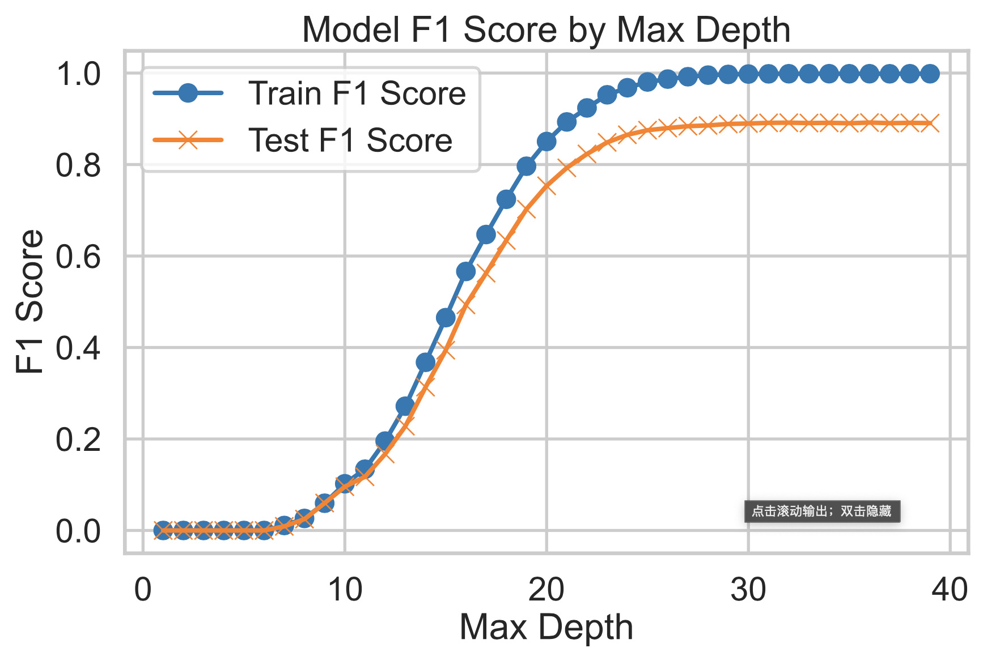

# Statistical Analysis of Breakfast Recipes 

This is a data science project for DSC 80 at UCSD.  
Author: Yujie Kang

## Introduction

### General
This project focused on the analysis of breakfast recipes, aiming to uncover distinctive features and patterns that differentiate them from other types of recipes. Breakfast is often regarded as the most important meal of the day, providing essential nutrients and energy required to start the day efficiently. Understanding what makes a breakfast recipe unique can provide insights into dietary habits and potentially guide healthier eating choices. So I'm wondering if **breakfast recipes are different from other recipes in the nutrition facts and time complexity**. The project aims to offer valuable insights into the composition and uniqueness of breakfast recipes, contributing to broader nutritional studies and practical applications in meal planning and dietary recommendations.

To get the information about the recipes, I gathered two datasets `recipes` and `interactions` from [food.com](https://www.food.com/). These two datasets was originally scraped and used by the authors of [Generating Personalized Recipes from Historical User Preferences](https://cseweb.ucsd.edu/~jmcauley/pdfs/emnlp19c.pdf) paper.

### Columns
The first dataset, `recipe`, contains _83782_ rows and _10_ columns, which contains _83782_ unique recipes and _10_ different types of information about each unique recipe, the informations are as follows:

| Column          | Description                                                                                                                                                    |
| --------------- | -------------------------------------------------------------------------------------------------------------------------------------------------------------- |
| `name`          | Recipe name                                                                                                                                                    |
| `id`            | Recipe ID                                                                                                                                                      |
| `minutes`       | Minutes to prepare recipe                                                                                                                                      |
| `contributor_id`| User ID who submitted this recipe                                                                                                                               |
| `submitted`     | Date recipe was submitted                                                                                                                                      |
| `tags`          | Food.com tags for recipe                                                                                                                                       |
| `nutrition`     | Nutrition information in the form [calories (#), total fat (PDV), sugar (PDV), sodium (PDV), protein (PDV), saturated fat (PDV), carbohydrates (PDV)]; PDV stands for “percentage of daily value” |
| `n_steps`       | Number of steps in recipe                                                                                                                                      |
| `steps`         | Text for recipe steps, in order                                                                                                                                |
| `description`   | User-provided description                                                                                                                                      |

 
The second dataset, `interactions`, contains *731927* rows and *5* columns. It includes user's interaction with the recipes, including the following information:

| Column      | Description             |
| ----------- | ----------------------- |
| `user_id`   | User ID                 |
| `recipe_id` | Recipe ID               |
| `date`      | Date of interaction     |
| `rating`    | Rating given            |
| `review`    | Review text             |

## Data Cleaning and Exploratory Data Analysis

### Data Cleaning

1. The recipe and interaction datasets were left-merged to create a comprehensive dataset containing both recipe details and user interactions.
2. There were many 0s in the rating column. Since the lowest possible rating is 1, these 0 values were converted to NaN to accurately reflect missing or invalid ratings.
3. I checked the `n_steps` and `n_ingredients` columns to ensure that no steps or ingredients have a count of 0.
4. A new column `mean_rating` was created to provide a representative average rating for each recipe.
5. I examined the data types and appropriate conversions were made: the `submitted` and `date` columns were converted to datetime format. The `tags`, `nutrition`, `steps`, and `ingredients` columns were converted to lists, as they were originally stored as strings but represented list-like data. 
6. An `is_breakfast` column was added to the dataset to identify and classify breakfast recipes.
7. The values in the `nutrition` column were split into separate columns for easier analysis: `calories`, `total_fat`, `sugar`, `sodium`, `protein`, `saturated_fat`, and `carbohydrates`.

The final dataframe has these columns and their types are listed at the right:

| Column          | Data Type                                    |
| --------------- | -------------------------------------------- |
| `name`          | `str`                                        |
| `minutes`       | `int64`                                      |
| `contributor_id`| `int64`                                      |
| `submitted`     | `Timestamp`                                  |
| `tags`          | `list`                                       |
| `n_steps`       | `int64`                                      |
| `steps`         | `list`                                       |
| `description`   | `str`                                        |
| `ingredients`   | `list`                                       |
| `n_ingredients` | `int64`                                      |
| `user_id`       | `float64`                                    |
| `recipe_id`     | `float64`                                    |
| `date`          | `Timestamp`                                  |
| `rating`        | `float64`                                    |
| `review`        | `str`                                        |
| `mean_rating`   | `float64`                                    |
| `is_breakfast`  | `bool`                                       |
| `calories`      | `float64`                                    |
| `total_fat`     | `float64`                                    |
| `sugar`         | `float64`                                    |
| `sodium`        | `float64`                                    |
| `protein`       | `float64`                                    |
| `saturated_fat` | `float64`                                    |
| `carbohydrates` | `float64`                                    |

The first 3 rows of the cleaned dafaframe looks like this:

| name                                | minutes | contributor_id | submitted   | ...   | sodium | protein |saturated_fat  |carbohydrates |
|-------------------------------------|---------|----------------|-------------|-------|--------|---------|---------------|---------------|
| 1 brownies in the world best ever   | 40      | 985201         | 2008-10-27  | ...   | 3.0    | 3.0     | 19.0          | 6.0           |
| 1 in canada chocolate chip cookies  | 45      | 1848091        | 2011-04-11  | ...   | 22.0   | 13.0    | 51.0          | 26.0          |
| 412 broccoli casserole              | 40      | 50969          | 2008-05-30  | ...   | 32.0   | 22.0    | 36.0          | 3.0           |

### Univariate Analysis

The plot shows the distribution of number of ingredients for breakfast recipes. The distribution of ingredient counts in breakfast recipes mostly falls below 20. This indicates that breakfast recipes typically require fewer ingredients. This simplicity suggests that breakfast dishes often more simple, maybe people prefer to eat less during morning. 

<iframe
  src="assets/ingredients_distribution.html"
  width="800"
  height="600"
  frameborder="0"
></iframe>

### Bivariate Analysis

Let's make some comparison for breakfast recipes and non-breakfast recipes. First, check their distribution of number of steps and see if it's different. As we can see, there are fewer breakfast recipes with more steps compared to non-breakfast recipes, suggesting that breakfast dishes often prioritize simplicity and efficiency in preparation. This trend reflects the preference for quick meal options in the morning. In contrast, non-breakfast recipes may involve more elaborate cooking processes, catering to different mealtime dynamics and culinary preferences throughout the day.

<iframe
  src="assets/n_steps.html"
  width="800"
  height="600"
  frameborder="0"
></iframe>

### Interesting Aggregates 
For this section, I investigated the relationship between the breakfast and non-breakfast recipes with their nutrition facts. Breakfast recipes have lower means in all demensions of `calories`, `total_fat`,`sugar`, `sodium`, `protein`, `saturated_fat`, and `carbohydrates` compared to non-breakfast recipes. This suggests that breakfast recipes tend to be healthier and lighter in terms of these nutritional components. This finding aligns with dietary recommendations that emphasize consuming nutrient-dense and balanced meals to start the day on a healthy note.

|                 | calories | carbohydrates | protein | saturated_fat | sodium | sugar | total_fat |
|-----------------|----------|---------------|---------|---------------|--------|-------|-----------|
| non-breakfast   | 433.74   | 13.82         | 33.75   | 40.56         | 29.58  | 69.18 | 32.97     |
| breakfast       | 374.11   | 13.32         | 24.13   | 35.63         | 19.62  | 61.11 | 27.58     |

 
Here's another plot focusing on the calories of the breakfast recipes vs. non-breakfast recipes. While both breakfast and non-breakfast recipes have varying calorie counts, non-breakfast recipes tend to exhibit higher average and maximum calorie values. And there is a strange calorie of 0 in the non-breakfast recipes. 

|             | mean   | median | min | max   | std    |
|-------------|--------|--------|-----|-------|--------|
| non-breakfast       | 433.74 | 307.1  | 0.0 | 45609.0| 645.40 |
| breakfast        | 374.11 | 285.5  | 0.9 | 22371.2| 487.37 |

## Assessment of Missingness

There are significant missing values in `description`, `rating`, and `review` columns from the original dataframe. In which, `description` has 114 missing values, `rating` has 15036 missing values, and `review` has 58 missing values in the combined dataframe. 

### NMAR Analysis
I believe that the missingness of the `rating` column is **NMAR**. Since the number of missing values in `rating` column is more than the number of missing values in `review` column, some people might just want to leave a review and do not want to rate the recipe. Maybe people have uncertainty in rating and just want to tell people what they think about the recipe.

### Missingness Dependency
The missingness of `mean_rating` is because of the `rating` column. I'll try to investigate whether the missingness of description depends on the number of ingredients in the recipe or the day of week of the recipe.

> **Number of Ingredients**

**Null Hypothesis**: The distribution of number of ingredients where the description is missing is the same as the distribution of number of ingredients when the description is not missing.

**Alternate Hypothesis**: The distribution of number of ingredients where the description is missing is different from the distribution of number of ingredients when the description is not missing.

**Test Statistic**: The absolute difference of mean in number of ingredients between recipes with missing description and recipes without missing description.

**Significance Level**: 0.05

Here's the distribution of ingredients for missing distriptions comparing to not missing discriptions:

<iframe
  src="assets/missingdist1.html"
  width="800"
  height="600"
  frameborder="0"
></iframe>

The recipes with descriptions are having a more normal distribution shape on the number of ingredients, and recipes without descriptions has a more irregular shape, which might imply the missingness is not completely at random.

Here's the distribution of absolute differences of recipes' ingredients with missing distriptions comparing to recipes without missing discriptions:

<iframe
  src="assets/missingtest1.html"
  width="800"
  height="600"
  frameborder="0"
></iframe>

The observed statistics is about 1.133. The p-value I got is 0.002, which is smaller than our significance level 0.05. Therefore, we reject the null hypothesis and in favor of the alternative hypothesis that the missingness of description depends on the 'n_ingredients' column.

> **Day of Week**
**Null Hypothesis**: The distribution of day of week where the description are missing is the same as those descriptions are not missing.

**Alternate Hypothesis**:The distribution of day of week where the description are missing are different from those descriptions are not missing.

**Test Statistic**: The absolute difference of mean in day of week between recipes with missing description and recipes without missing description.

**Significance Level**: 0.05

<iframe
  src="assets/missingdist1.html"
  width="800"
  height="600"
  frameborder="0"
></iframe>

Most recipes with missing description submitted on Thursday, maybe it's a busy day for people. 

Here's the distribution of absolute differences of recipes with missing distriptions comparing to recipes missing discriptions:

<iframe
  src="assets/missingtest2.html"
  width="800"
  height="600"
  frameborder="0"
></iframe>

The observed statistics is about 0.0968. The p-value I got is 0.603, which is much larger than the significance level 0.05. Therefore, I **fail to reject the null hypothesis**. The missingness of the description column does not depend on the day of week of the submission.

## Hypothesis Testing

I would like to explore more about whether breakfast recipes will have less calories since people tend to eat lighter at morning.
I plan to run a *permutation test* on the following hypotheses, test statistic, and significance level:

**Null Hypothesis**: Breakfast recipes have the same calories as other recipes.

**Alternative Hypothesis**: Breakfast recipes have less calories than other recipes.

**Test Statistic**: The difference in mean rating between breakfast recipes and other recipes.

**Significance Level**: 0.05

<iframe
  src="assets/hypothesis.html"
  width="800"
  height="600"
  frameborder="0"
></iframe>

The p-value I got is 0.007, which is lower than the significance level 0.05. Therefore, we reject the null hypothesis and in favor of the alternative hypothesis in the permutation test. The breakfast recipes tend to have fewer calories than other recipes. This finding is consistent with people typically choosing lighter, more nutritious options at breakfast, possibly in an effort to start the day with a healthier meal. The observed differences in calorie content suggest that breakfast recipes are intentionally lower in calorie content to meet typical dietary preferences and nutritional considerations when consumed in the morning.

## Framing a Prediction Problem

My model will try to **predict whether the recipe is a breakfast recipe** based on other variables in the dataset. This will be a binary classification since it's either a breakfast recipe or not breakfast recipe. 

I use F1 score as the metric to evaluate my model because the data is not balances, there are much more recipes that are not breakfast in the data, if the model consistantly predict *False*, then the accuracy will be very high but it's not actually accurate. 

At the time of prediction, we would know all the information about the recipe except whether it is a breakfast recipe, which is from the `tag` column of the dataframe.

## Baseline Model

I decide to use a **RandomForestClassifier** as my Baseline Model. I used `calories` and `minutes` as the primary predictors of my model, they are both quantitative variables. This choice was made by the simplicity of these variables and their relevance to breakfast recipes. 

In this model, I used StandardScaler to standardize the features to make sure that they are in comparable range since the minutes and calories both have very excessive maximum values. The RandomForestClassifier can effectively segment the dataset based on these attributes utilizes their values to categorize recipes into breakfast and non-breakfast categories.

The F1 score of the model is about 0.765, which is pretty fair. But there are still some improvement space.

## Final Model
As we saw the previous EDA, the `minutes`, `n_steps`, `n_ingredients` and the nutrition facts of the receipts are highly related to whether the recipe is breakfast. However we should not use all of them because some of them might not be very representative. 

Therefore, I choose to use `calories`, `sodium`, `saturated_fat`, and `minutes` as the features to predict whether it is a breakfast recipe. They are all quantitative continuous variables. I still keep **RandomForestClassifier** as my Final Model.

As I mentioned above, I used StandardScaler to standardize the features to make sure that they are in comparable range. I used RobustScaler for `sodium` and `saturated_fat` columns because they have significant outliers, which migh effect the efficienty of the model.

Since the GridSearchCV takes forever on my laptop, I decide to find the best hyperparameter manually. As shown in the plot, the best parameter might be around 20. Beyond this point, the train F1 score consistently remains at 1, suggesting a potential issue with overfitting.

I got F1 score about 0.96 in the final model. Which means the model can predict most recipes correctly.

## Fairness Analysis

For the fairness analysis, I want to compare the groups that the preparing minutes are less than or equal to 15 minutes and the preparing minutes are that are greater than 15 minutes. Since the morning time is very short, recipes that require less than 15 minutes to prepare are typically perceived as quicker options suitable for breakfast, due to the limited time available during morning hours. However, falsely categorizing time-consuming recipes as breakfast options could potentially disrupt this efficiency, leading people to invest more morning time than expected. 

Therefore, I decide to evaluate the **precision parity** of the model for the two groups because the false evaluation of breakfast may lead people to waste time in the morning.

**Null Hypothesis**: The model is fair, preparing minutes that are less than or equal to 15 minutes and the preparing minutes are that are greater than 15 minutes are evaluated the same.

**Alternative Hypothesis**: The model is not fair, preparing minutes that are less than or equal to 15 minutes and the preparing minutes are that are greater than 15 minutes are evaluated differently.

**Test Statistic**: The absolute difference of their F1 score.

**Significance Level**: 0.05

<iframe
  src="assets/fair.html"
  width="800"
  height="600"
  frameborder="0"
></iframe>

To run the permutation test, I split the dataframe into recipes that takes less or equal to 15 minutes and recipes that takes more than 15 minutes, and meaure their precision. The observed absolute difference of their precision is xx. I do the same thing after shuffling the `minutes` column. I performed 100 times for the permutation test due to the limit performance of my laptop. The observed absolute difference is about 0.0005. The p-value I got is 0.41. Therefore, I fail to reject the null hypothesis. The model is fair for recipes with short time and recipes that takes longer time. 